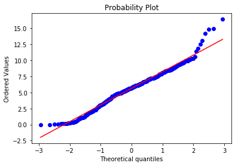

# UK Population Analysis


## Importing Modules
```
import pandas as pd
import numpy as np
import matplotlib.pyplot as plt
import seaborn as sns
from scipy.stats import zscore
import copy
from scipy.stats import ttest_ind
from PIL import Image
```

## Data Parsing and Cleaning
```python
file=pd.ExcelFile('population.xlsx')
df=file.parse('Dataset',skiprows=2)
df=df.drop_duplicates()							# Removing Duplicates 
df['Geography'] = df['Geography'].str.lower()   # Lower Case the geographies if any discrepancy while recording the data
```


## Inspecting the data set
```python
print(df.info())
print('\n \n')
print('First 3 Records sorted by "2013": \n')
print(str(df.sort_values('2013',ascending=True).head(3)))
print('Last 3 Records sorted by "2013": \n')
print('\n \n')
print(str(df.sort_values('2013',ascending=False).head(3)))
print('\n \n')
print('Descriptive Statistics: \n'+ str(df.describe()))
```

    <class 'pandas.core.frame.DataFrame'>
    Int64Index: 120120 entries, 0 to 120119
    Data columns (total 9 columns):
    Geography         120120 non-null object
    Geography code    120120 non-null object
    Age               120120 non-null object
    Sex               120120 non-null object
    2013              120120 non-null int64
    2014              120120 non-null int64
    2015              120120 non-null int64
    2016              120120 non-null int64
    Bin_Age           120120 non-null category
    dtypes: category(1), int64(4), object(4)
    memory usage: 8.4+ MB
    None
    
     
    
    First 3 Records sorted by "2013": 
    
                 Geography Geography code Age     Sex  2013  2014  2015  2016  \
    21560   city of london      E09000001  89    Male     0     6    12     9   
    52136  isles of scilly      E06000053  89    Male     0     2     6    10   
    51901  isles of scilly      E06000053  18  Female     0     4     7     5   
    
          Bin_Age  
    21560     65+  
    52136     65+  
    51901   16-63  
    Last 3 Records sorted by "2013": 
    
                 Geography Geography code Age  Sex    2013    2014    2015  \
    106599  united kingdom      K02000001  48  All  946543  938073  938658   
    106593  united kingdom      K02000001  46  All  938474  925281  925304   
    106596  united kingdom      K02000001  47  All  938379  938242  926005   
    
              2016 Bin_Age  
    106599  926287   16-63  
    106593  903397   16-63  
    106596  925800   16-63  
    
     
    
    Descriptive Statistics: 
                    2013           2014           2015           2016
    count  120120.000000  120120.000000  120120.000000  120120.000000
    mean     6636.276057    6687.961122    6741.755261    6798.140909
    std     46218.249761   46527.075036   46868.299221   47215.326790
    min         0.000000       2.000000       0.000000       0.000000
    25%       580.000000     585.000000     589.000000     594.000000
    50%       978.000000     986.000000     995.000000    1003.000000
    75%      1879.000000    1893.000000    1905.000000    1921.000000
    max    946543.000000  946383.000000  946132.000000  945494.000000
    

### Inference:

```python
The Median and Mean are way off. Same is for Maximum and 75%ile. Here we can sense some outliers.

By inspection, we can also see that United Kingdom being an island country consisting Scotland, Northern Ireland, Wales, England, 
while Isles of Scilly being an Archipelago

This implies, All layers of granularity (Hierarchy: grouped countries, countries, counties, towns, district) is present in the data.

Due to this reason, we cannot analyse the data based on aggregrated functions or statistics, we need to seperate each layer of heirarchy.
```

## Data Preprocessing : Adding bins to Age (Below and Over 65 year age) 

```python
df["Bin_Age"]=df["Age"]
bins =[0,66]
labels=['<=65','>65']
df.Bin_Age=df.Bin_Age.replace('90+',91)
df.Bin_Age=df.Bin_Age.astype('int32')
df['Bin_Age'] = pd.cut(df['Bin_Age'],right=False,labels=labels,bins=np.r_[bins, np.inf])
```

## Strategy
```python
Action Strategy to rectify this outliers:

1.We should analyse:break down dataset into countries, counties, until lowest level of granularity is achieved. 
   In technical terms, we have to spatially dis-aggregrate the data.

2. Also, check for abnormalities, while breaking it down using : ttests and zscores.

3. If we do not seperate the layers of data out, we will have unreliable statistic (z-scores, t-scores)

I will demonstrate the above strategy by analysing each country of United Kingdom
```


## Using Geographical codes to seperate Scotland, Northern Ireland, Wales and England-- countries of United Kingdom


```python
Scotland=df[(df['Geography code'].astype(str).str[0]=='S') & (df['Geography']!='scotland')]
Northern_Ireland=df[(df['Geography code'].astype(str).str[0]=='N') &(df['Geography']!='northern ireland')]
England=df[(df['Geography code'].astype(str).str[0]=='E') & (df['Geography']!='england')]
Wales=df[(df['Geography code'].astype(str).str[0]=='W')&(df['Geography']!='wales')]
Grouped_Countries=df[df['Geography code'].astype(str).str[0]=='K']
```


### Analysis for Scotland


```python
Scotland.groupby(['Geography']).sum().shape 

Output: (32, 4)

```


    


#### Realization
```python
Shape of 32 here validates that Scotland has 32 councils
```

#### Box Plot for Population Distribution grouped by Geography for every year

```python
Scotland[(Scotland['Sex']=='All') ].groupby(['Geography']).sum().plot(kind='box')
```


#### Detecting Outliers based on Z-Score  ( greater than 3 and less than -3) :Thresholds are subjective
```python
temp1=Scotland[ (Scotland['Sex']=='All') ].groupby(['Geography']).sum()
temp2=temp1.apply(zscore)
temp2.columns=['Z(2013)','Z(2014)','Z(2015)','Z(2016)']
temp1=pd.merge(temp1,temp2,on='Geography')
print('Abnormally Populated Scotland Geography in 2013: \n' + str(temp1[(temp1['Z(2013)']>=3.) | (temp1['Z(2013)']<=-3.)][['2013','2014','2015','2016']]))
print('\nAbnormally Populated Scotland Geography in 2014: \n' + str(temp1[(temp1['Z(2014)']>=3.) | (temp1['Z(2014)']<=-3.)][['2013','2014','2015','2016']]))
print('\nAbnormally Populated Scotland Geography in 2015: \n' + str(temp1[(temp1['Z(2015)']>=3.) | (temp1['Z(2015)']<=-3.)][['2013','2014','2015','2016']]))
print('\nAbnormally Populated Scotland Geography in 2016: \n' + str(temp1[(temp1['Z(2016)']>=3.) | (temp1['Z(2016)']<=-3.)][['2013','2014','2015','2016']]))

```

    Abnormally Populated Scotland Geography in 2013: 
                 2013    2014    2015    2016
    Geography                                
    highland   596520  599640  234110  234770
    
    Abnormally Populated Scotland Geography in 2014: 
                 2013    2014    2015    2016
    Geography                                
    highland   596520  599640  234110  234770
    
    Abnormally Populated Scotland Geography in 2015: 
                    2013    2014    2015    2016
    Geography                                   
    glasgow city  366900  367250  606340  615070
    
    Abnormally Populated Scotland Geography in 2016: 
                    2013    2014    2015    2016
    Geography                                   
    glasgow city  366900  367250  606340  615070
    

#### Inference
```python
The Numbers are unrealistic: The population changed drastically (fluctuated) from 2013 to 2016 for all the geographies mentioned above.

Reasons can be: Migration, Large Mortality Rate, Change of Jurisdication, Poor Data Quality

Other dots outside box plots indicate abnormality under tolerance. It is obvious sometimes because more population happens to stay in urban over rural settings.
```


### Analysis For Northern Ireland

#### Box Plot for Population Distribution grouped by Geography for every year

```python
Northern_Ireland[(Northern_Ireland['Sex']=='All') ].groupby(['Geography']).sum().plot(kind='box')
```


#### Detecting Outliers based on Z-Score  ( greater than 2 and less than -2) :Thresholds are subjective

```python

temp1=Northern_Ireland[(Northern_Ireland['Sex']=='All') ].groupby(['Geography']).sum()
temp2=temp1.apply(zscore)
temp2.columns=['Z(2013)','Z(2014)','Z(2015)','Z(2016)']
temp1=pd.merge(temp1,temp2,on='Geography')
print('Abnormally Populated N.I. Geography in 2013: \n' + str(temp1[(temp1['Z(2013)']>=2.) | (temp1['Z(2013)']<=-2.)][['2013','2014','2015','2016']]))
print('\nAbnormally Populated N.I. Geography in 2014: \n' + str(temp1[(temp1['Z(2014)']>=2.) | (temp1['Z(2014)']<=-2.)][['2013','2014','2015','2016']]))
print('\nAbnormally Populated N.I. Geography in 2015: \n' + str(temp1[(temp1['Z(2015)']>=2.) | (temp1['Z(2015)']<=-2.)][['2013','2014','2015','2016']]))
print('\nAbnormally Populated N.I. Geography in 2016: \n' + str(temp1[(temp1['Z(2016)']>=2.) | (temp1['Z(2016)']<=-2.)][['2013','2014','2015','2016']]))
```

    Abnormally Populated N.I. Geography in 2013: 
                 2013    2014    2015    2016
    Geography                                
    belfast    335133  142303  338907  339579
    
    Abnormally Populated N.I. Geography in 2014: 
                                            2013    2014    2015    2016
    Geography                                                           
    armagh city, banbridge and craigavon  203757  336830  207797  210260
    
    Abnormally Populated N.I. Geography in 2015: 
                 2013    2014    2015    2016
    Geography                                
    belfast    335133  142303  338907  339579
    
    Abnormally Populated N.I. Geography in 2016: 
                 2013    2014    2015    2016
    Geography                                
    belfast    335133  142303  338907  339579
    


#### Inference
```python
1. The Numbers are unrealistic: Huge fluctuation for each of these geographical regions

2. Reasons can be: Migration, Large Mortality Rate, Change in the jurisdications and calculations

3. Other dots outside box plots indicate abnormality under tolerance. 
It is obvious sometimes because more population happens to stay in urban over rural settings.

```


### Analysis for Wales

#### Box Plot for Population Distribution grouped by Geography for every year


```python
Wales[(Wales['Geography']!='Wales') & (Wales['Sex']=='All') ].groupby(['Geography']).sum().plot(kind='box')
```


```python
Wales[(Wales['Sex']=='All') ].groupby(['Geography']).sum().shape
```


    (22, 4)


#### Realization
```python
Wales has 22 counties.
```


#### Detecting Outliers based on Z-Score  ( greater than 2 and less than -2) :Thresholds are subjective
```python
temp1=Wales[(Wales['Sex']=='All') ].groupby(['Geography']).sum()
temp2=temp1.apply(zscore)
temp2.columns=['Z(2013)','Z(2014)','Z(2015)','Z(2016)']
temp1=pd.merge(temp1,temp2,on='Geography')
print('Abnormally Populated Wales Geography in 2013: \n' + str(temp1[(temp1['Z(2013)']>=2.) | (temp1['Z(2013)']<=-2.)][['2013','2014','2015','2016']]))
print('\nAbnormally Populated Wales Geography in 2014: \n' + str(temp1[(temp1['Z(2014)']>=2.) | (temp1['Z(2014)']<=-2.)][['2013','2014','2015','2016']]))
print('\nAbnormally Populated Wales Geography in 2015: \n' + str(temp1[(temp1['Z(2015)']>=2.) | (temp1['Z(2015)']<=-2.)][['2013','2014','2015','2016']]))
print('\nAbnormally Populated Wales Geography in 2016: \n' + str(temp1[(temp1['Z(2016)']>=2.) | (temp1['Z(2016)']<=-2.)][['2013','2014','2015','2016']]))
```

    Abnormally Populated Wales Geography in 2013: 
                         2013    2014    2015    2016
    Geography                                        
    rhondda cynon taf  351710  354294  237411  238306
    
    Abnormally Populated Wales Geography in 2014: 
                         2013    2014    2015    2016
    Geography                                        
    rhondda cynon taf  351710  354294  237411  238306
    
    Abnormally Populated Wales Geography in 2015: 
                 2013    2014    2015    2016
    Geography                                
    cardiff    127159  127685  357160  361468
    
    Abnormally Populated Wales Geography in 2016: 
                 2013    2014    2015    2016
    Geography                                
    cardiff    127159  127685  357160  361468
    

#### Inference
```python
The Numbers are unrealistic: Huge fluctuation for each of these geographical regions in every year
Reasons: Migration, Large Mortality Rate, Change in the jurisdications and calculations, Poor Data Quality

```


### Analysis for England

#### Box Plot for Population Distribution grouped by Geography for every year


```python
England[(England['Sex']=='All') ].groupby(['Geography']).sum().plot(kind='box')
```


#### Inference
```python
Gaps in the outliers here,indicate various layers of hierarchy or granularity in the England dataset
```

#### Detecting (NUTS: 9 top layers in England for statistical purposes) 1st Layer of heirarchy in England

```python
temp1=England[(England['Sex']=='All') ].groupby(['Geography']).sum()
temp2=temp1.apply(zscore)
temp2.columns=['Z(2013)','Z(2014)','Z(2015)','Z(2016)']
temp1=pd.merge(temp1,temp2,on='Geography')
england_parts=temp1[(temp1['Z(2013)']>=2.) | (temp1['Z(2013)']<=-2.)][['2013','2014','2015','2016']].sort_values(by=['2013'],ascending=False).index.tolist()
england_parts.remove('greater manchester')  ### Removed because its not the official sub division and also a county
temp1[(temp1['Z(2013)']>=2.) | (temp1['Z(2013)']<=-2.)][['2013','2014','2015','2016']].sort_values(by=['2013'],ascending=False)
```


<div>
<style scoped>
    .dataframe tbody tr th:only-of-type {
        vertical-align: middle;
    }

    .dataframe tbody tr th {
        vertical-align: top;
    }

    .dataframe thead th {
        text-align: right;
    }
</style>
<table border="1" class="dataframe">
  <thead>
    <tr style="text-align: right;">
      <th></th>
      <th>2013</th>
      <th>2014</th>
      <th>2015</th>
      <th>2016</th>
    </tr>
    <tr>
      <th>Geography</th>
      <th></th>
      <th></th>
      <th></th>
      <th></th>
    </tr>
  </thead>
  <tbody>
    <tr>
      <th>south east</th>
      <td>8792766</td>
      <td>8873818</td>
      <td>8947913</td>
      <td>9026297</td>
    </tr>
    <tr>
      <th>west midlands</th>
      <td>8458187</td>
      <td>8521640</td>
      <td>8584557</td>
      <td>8665659</td>
    </tr>
    <tr>
      <th>london</th>
      <td>8416543</td>
      <td>8538689</td>
      <td>8673713</td>
      <td>8787892</td>
    </tr>
    <tr>
      <th>north west</th>
      <td>7103261</td>
      <td>7132991</td>
      <td>7173835</td>
      <td>7219623</td>
    </tr>
    <tr>
      <th>east of england</th>
      <td>5954316</td>
      <td>6018383</td>
      <td>6076451</td>
      <td>6130542</td>
    </tr>
    <tr>
      <th>south west</th>
      <td>5377596</td>
      <td>5423303</td>
      <td>5471180</td>
      <td>5515953</td>
    </tr>
    <tr>
      <th>yorkshire and the humber</th>
      <td>5337711</td>
      <td>5360027</td>
      <td>5390576</td>
      <td>5425741</td>
    </tr>
    <tr>
      <th>east midlands</th>
      <td>4598431</td>
      <td>4637413</td>
      <td>4677038</td>
      <td>4724437</td>
    </tr>
    <tr>
      <th>greater manchester</th>
      <td>2714944</td>
      <td>2732854</td>
      <td>2756162</td>
      <td>2782141</td>
    </tr>
    <tr>
      <th>north east</th>
      <td>2610481</td>
      <td>2618710</td>
      <td>2624621</td>
      <td>2636848</td>
    </tr>
  </tbody>
</table>
</div>


#### Inference
```python
Greater Manchester (A county) is more populated than other pre-layered regions of England
```
#### Action: Separate this sub-regions out.
```python
England_sub=England[(England['Geography'].isin(england_parts)) &(England['Sex']=='All') ]
England_new=England[~(England['Geography'].isin(england_parts))]
England_new=England_new[England_new['Sex']=='All']
```


#### Analysing Seperated (Layer 2 and sub regions) Data for England

##### Box Plot for Population Distribution grouped by Geography for every year: Layer 2

```python
England_new.groupby('Geography').sum().plot(kind='box')
```


#### Inference

```python
Presence of Layer 2 
```

#### Box Plot for Sub-Regions  (NUTS-Nomenclature of Territorial Units for Statistics) of England every year


```python
England_sub.plot(kind='box')
`
```


#### Inference and hypothesis:
```python
The outliers here exhibit "Age" Factor has uneven distributed across the sub-regions

We can also hypothesize whether female-male ratio is abnormal
```

##### Box Plot for England Sub regions grouped by Age, for each year
```python
England_sub.groupby(['Age']).sum().plot(kind='box')
```


```python
temp=England_sub.groupby(['Age']).sum().apply(zscore)
temp[(temp['2013']>2.) | (temp['2013']<-2.)]
```


<div>
<style scoped>
    .dataframe tbody tr th:only-of-type {
        vertical-align: middle;
    }

    .dataframe tbody tr th {
        vertical-align: top;
    }

    .dataframe thead th {
        text-align: right;
    }
</style>
<table border="1" class="dataframe">
  <thead>
    <tr style="text-align: right;">
      <th></th>
      <th>2013</th>
      <th>2014</th>
      <th>2015</th>
      <th>2016</th>
    </tr>
    <tr>
      <th>Age</th>
      <th></th>
      <th></th>
      <th></th>
      <th></th>
    </tr>
  </thead>
  <tbody>
    <tr>
      <th>84</th>
      <td>-2.109263</td>
      <td>-2.095839</td>
      <td>-2.113620</td>
      <td>-2.149178</td>
    </tr>
    <tr>
      <th>85</th>
      <td>-2.244440</td>
      <td>-2.243814</td>
      <td>-2.233470</td>
      <td>-2.254175</td>
    </tr>
    <tr>
      <th>86</th>
      <td>-2.349248</td>
      <td>-2.378641</td>
      <td>-2.382112</td>
      <td>-2.377405</td>
    </tr>
    <tr>
      <th>87</th>
      <td>-2.454926</td>
      <td>-2.486979</td>
      <td>-2.516337</td>
      <td>-2.524560</td>
    </tr>
    <tr>
      <th>88</th>
      <td>-2.568775</td>
      <td>-2.593274</td>
      <td>-2.625386</td>
      <td>-2.657771</td>
    </tr>
    <tr>
      <th>89</th>
      <td>-2.671836</td>
      <td>-2.705433</td>
      <td>-2.730845</td>
      <td>-2.765252</td>
    </tr>
  </tbody>
</table>
</div>


#### Inference:
```python
In the above diagram: It is apparent with negative z-score values less than -2, Across England Sub regions, People above age 83 and less than 90 are less in number (statistically)

```


#### Analysis for Layer 2 of England

##### Box Plots for Layer 2 England Population DIstribution, Grouped by Geography

```python
England_new.groupby('Geography').sum().plot(kind='box')

```


#### Inference
```python
Again,Here outliers indicates one more layer of aggregration present in Data.
```


#### Detecting Layer 2 (Counties) in England

```python
temp1=England_new[(England_new['Sex']=='All') ].groupby(['Geography']).sum()
temp2=temp1.apply(zscore)
temp2.columns=['Z(2013)','Z(2014)','Z(2015)','Z(2016)']
temp1=pd.merge(temp1,temp2,on='Geography')
temp1[(temp1['Z(2013)']>=3.) | (temp1['Z(2013)']<=-3.)][['2013','2014','2015','2016']].sort_values(by=['2013'],ascending=False)

```


<div>
<style scoped>
    .dataframe tbody tr th:only-of-type {
        vertical-align: middle;
    }

    .dataframe tbody tr th {
        vertical-align: top;
    }

    .dataframe thead th {
        text-align: right;
    }
</style>
<table border="1" class="dataframe">
  <thead>
    <tr style="text-align: right;">
      <th></th>
      <th>2013</th>
      <th>2014</th>
      <th>2015</th>
      <th>2016</th>
    </tr>
    <tr>
      <th>Geography</th>
      <th></th>
      <th></th>
      <th></th>
      <th></th>
    </tr>
  </thead>
  <tbody>
    <tr>
      <th>greater manchester</th>
      <td>2714944</td>
      <td>2732854</td>
      <td>2756162</td>
      <td>2782141</td>
    </tr>
    <tr>
      <th>west yorkshire</th>
      <td>2252199</td>
      <td>2264329</td>
      <td>2281718</td>
      <td>2299673</td>
    </tr>
    <tr>
      <th>kent</th>
      <td>1493512</td>
      <td>1510354</td>
      <td>1524719</td>
      <td>1541893</td>
    </tr>
    <tr>
      <th>essex</th>
      <td>1416405</td>
      <td>1431953</td>
      <td>1443151</td>
      <td>1455340</td>
    </tr>
    <tr>
      <th>merseyside</th>
      <td>1386589</td>
      <td>1391113</td>
      <td>1398030</td>
      <td>1406447</td>
    </tr>
    <tr>
      <th>south yorkshire</th>
      <td>1358153</td>
      <td>1365847</td>
      <td>1374655</td>
      <td>1384969</td>
    </tr>
    <tr>
      <th>hampshire</th>
      <td>1337730</td>
      <td>1346136</td>
      <td>1353043</td>
      <td>1360426</td>
    </tr>
    <tr>
      <th>lancashire</th>
      <td>1180077</td>
      <td>1184735</td>
      <td>1191691</td>
      <td>1198798</td>
    </tr>
    <tr>
      <th>surrey</th>
      <td>1152114</td>
      <td>1161256</td>
      <td>1168809</td>
      <td>1176549</td>
    </tr>
    <tr>
      <th>hertfordshire</th>
      <td>1140703</td>
      <td>1154766</td>
      <td>1166339</td>
      <td>1176720</td>
    </tr>
    <tr>
      <th>tyne and wear</th>
      <td>1113577</td>
      <td>1118713</td>
      <td>1122194</td>
      <td>1128757</td>
    </tr>
  </tbody>
</table>
</div>


```python
England_counties=['Bedfordshire','Berkshire','Bristol','Buckinghamshire','Cambridgeshire','Cheshire','Cornwall','County Durham','Cumbria','Derbyshire','Devon','Dorset','East Riding of Yorkshire','East Sussex','Essex','Gloucestershire','City of London','Greater Manchester','Hampshire','Herefordshire','Hertfordshire','Isle of Wight','Isles of Scilly','Kent','Lancashire','Leicestershire','Lincolnshire','Merseyside','Norfolk','North Somerset','North Yorkshire','Northamptonshire','Northumberland','Nottinghamshire','Oxfordshire','Rutland','Shropshire','Somerset','South Yorkshire','Staffordshire','Suffolk','Surrey','Tyne and Wear','Warwickshire','West Midlands','West Sussex','West Yorkshire','Wiltshire','Worcestershire']
England_counties=[i.lower() for i in England_counties]
England_counties_df=England_new[England_new['Geography'].isin(England_counties)]
England_counties_df.groupby('Geography').sum().plot(kind='box')
temp=England_counties_df.groupby(['Geography']).sum().apply(zscore)
temp[(temp['2013']>2.) | (temp['2013']<-2.)]
```


<div>
<style scoped>
    .dataframe tbody tr th:only-of-type {
        vertical-align: middle;
    }

    .dataframe tbody tr th {
        vertical-align: top;
    }

    .dataframe thead th {
        text-align: right;
    }
</style>
<table border="1" class="dataframe">
  <thead>
    <tr style="text-align: right;">
      <th></th>
      <th>2013</th>
      <th>2014</th>
      <th>2015</th>
      <th>2016</th>
    </tr>
    <tr>
      <th>Geography</th>
      <th></th>
      <th></th>
      <th></th>
      <th></th>
    </tr>
  </thead>
  <tbody>
    <tr>
      <th>greater manchester</th>
      <td>3.621093</td>
      <td>3.619643</td>
      <td>3.623796</td>
      <td>3.629027</td>
    </tr>
    <tr>
      <th>west yorkshire</th>
      <td>2.757866</td>
      <td>2.751598</td>
      <td>2.751802</td>
      <td>2.749973</td>
    </tr>
  </tbody>
</table>
</div>


#### Inference:

```python
Greater Manchester and West Yorkshire are abnormally populous counties over others
```


#### Analysing Counties

##### Box plots for population distribution across england counties for each year

```python
England_counties_df.groupby('Age').sum().plot(kind='box')
```


    <matplotlib.axes._subplots.AxesSubplot at 0x1e5bb62ce10>


```python
temp=England_counties_df.groupby(['Age']).sum().apply(zscore)
temp[(temp['2013']>2.) | (temp['2013']<-2.)]
```


<div>
<style scoped>
    .dataframe tbody tr th:only-of-type {
        vertical-align: middle;
    }

    .dataframe tbody tr th {
        vertical-align: top;
    }

    .dataframe thead th {
        text-align: right;
    }
</style>
<table border="1" class="dataframe">
  <thead>
    <tr style="text-align: right;">
      <th></th>
      <th>2013</th>
      <th>2014</th>
      <th>2015</th>
      <th>2016</th>
    </tr>
    <tr>
      <th>Age</th>
      <th></th>
      <th></th>
      <th></th>
      <th></th>
    </tr>
  </thead>
  <tbody>
    <tr>
      <th>83</th>
      <td>-2.002369</td>
      <td>-2.012056</td>
      <td>-2.052671</td>
      <td>-2.131680</td>
    </tr>
    <tr>
      <th>84</th>
      <td>-2.173316</td>
      <td>-2.161783</td>
      <td>-2.176084</td>
      <td>-2.217692</td>
    </tr>
    <tr>
      <th>85</th>
      <td>-2.337342</td>
      <td>-2.335688</td>
      <td>-2.330343</td>
      <td>-2.349734</td>
    </tr>
    <tr>
      <th>86</th>
      <td>-2.459828</td>
      <td>-2.500538</td>
      <td>-2.505795</td>
      <td>-2.509322</td>
    </tr>
    <tr>
      <th>87</th>
      <td>-2.591249</td>
      <td>-2.628329</td>
      <td>-2.672036</td>
      <td>-2.683334</td>
    </tr>
    <tr>
      <th>88</th>
      <td>-2.731765</td>
      <td>-2.760722</td>
      <td>-2.803235</td>
      <td>-2.850751</td>
    </tr>
    <tr>
      <th>89</th>
      <td>-2.858613</td>
      <td>-2.899827</td>
      <td>-2.932731</td>
      <td>-2.979873</td>
    </tr>
  </tbody>
</table>
</div>


#### Analysing Layer 3 England


##### Box plot for Population Distribution across Layer 3  for England grouped by Geography.
```python
England_new_df=England_new[~England_new['Geography'].isin(England_counties)]
England_new_df.groupby('Geography').sum().plot(kind='box')
```


## Detecting abnormally populated Layer 3 regions  in England

```python
temp1=England_new_df[(England_new_df['Sex']=='All') ].groupby(['Geography']).sum()
temp2=temp1.apply(zscore)
temp2.columns=['Z(2013)','Z(2014)','Z(2015)','Z(2016)']
temp1=pd.merge(temp1,temp2,on='Geography')
england_populous_cities=temp1[(temp1['Z(2013)']>=3.) | (temp1['Z(2013)']<=-3.)][['2013','2014','2015','2016']].sort_values(by=['2013'],ascending=False).index.tolist()
temp1[(temp1['Z(2013)']>=3) | (temp1['Z(2013)']<=-3)][['2013','2014','2015','2016']].sort_values(by=['2013'],ascending=False)


```


<div>
<style scoped>
    .dataframe tbody tr th:only-of-type {
        vertical-align: middle;
    }

    .dataframe tbody tr th {
        vertical-align: top;
    }

    .dataframe thead th {
        text-align: right;
    }
</style>
<table border="1" class="dataframe">
  <thead>
    <tr style="text-align: right;">
      <th></th>
      <th>2013</th>
      <th>2014</th>
      <th>2015</th>
      <th>2016</th>
    </tr>
    <tr>
      <th>Geography</th>
      <th></th>
      <th></th>
      <th></th>
      <th></th>
    </tr>
  </thead>
  <tbody>
    <tr>
      <th>birmingham</th>
      <td>1092330</td>
      <td>1101360</td>
      <td>1111307</td>
      <td>1124569</td>
    </tr>
    <tr>
      <th>leeds</th>
      <td>761488</td>
      <td>766399</td>
      <td>774060</td>
      <td>781743</td>
    </tr>
    <tr>
      <th>sheffield</th>
      <td>560085</td>
      <td>563749</td>
      <td>569737</td>
      <td>575424</td>
    </tr>
    <tr>
      <th>bradford</th>
      <td>526369</td>
      <td>528155</td>
      <td>531176</td>
      <td>534279</td>
    </tr>
    <tr>
      <th>manchester</th>
      <td>514417</td>
      <td>520215</td>
      <td>530292</td>
      <td>541263</td>
    </tr>
  </tbody>
</table>
</div>


#### Inference
```python
These are Most Populous cities after London
```

```python
England_new_df_1=England_new_df[~England_new_df['Geography'].isin(england_populous_cities)]
England_new_df_1.groupby('Geography').sum().plot(kind='box')
```


```python
temp=England_new_df.groupby(['Geography']).sum().apply(zscore)
temp[(temp['2013']>3.) | (temp['2013']<-3.)]
```


<div>
<style scoped>
    .dataframe tbody tr th:only-of-type {
        vertical-align: middle;
    }

    .dataframe tbody tr th {
        vertical-align: top;
    }

    .dataframe thead th {
        text-align: right;
    }
</style>
<table border="1" class="dataframe">
  <thead>
    <tr style="text-align: right;">
      <th></th>
      <th>2013</th>
      <th>2014</th>
      <th>2015</th>
      <th>2016</th>
    </tr>
    <tr>
      <th>Geography</th>
      <th></th>
      <th></th>
      <th></th>
      <th></th>
    </tr>
  </thead>
  <tbody>
    <tr>
      <th>birmingham</th>
      <td>8.358045</td>
      <td>8.348224</td>
      <td>8.323884</td>
      <td>8.323317</td>
    </tr>
    <tr>
      <th>bradford</th>
      <td>3.253722</td>
      <td>3.226571</td>
      <td>3.201631</td>
      <td>3.175663</td>
    </tr>
    <tr>
      <th>leeds</th>
      <td>5.374227</td>
      <td>5.355309</td>
      <td>5.346170</td>
      <td>5.333685</td>
    </tr>
    <tr>
      <th>manchester</th>
      <td>3.145928</td>
      <td>3.155626</td>
      <td>3.193826</td>
      <td>3.236568</td>
    </tr>
    <tr>
      <th>sheffield</th>
      <td>3.557802</td>
      <td>3.544608</td>
      <td>3.542105</td>
      <td>3.534470</td>
    </tr>
  </tbody>
</table>
</div>

#### Inference

```python
There are no outliers now, which reduces the data to its most granular form
However, It is so obvious, that certain cities like birmingham, leeds etc are more populated then others
```
#### Hypothizing Age group abnormality:

```python
temp=England_counties_df.groupby(['Age']).sum().apply(zscore)
temp[(temp['2013']>2.) | (temp['2013']<-2.)]
```


<div>
<style scoped>
    .dataframe tbody tr th:only-of-type {
        vertical-align: middle;
    }

    .dataframe tbody tr th {
        vertical-align: top;
    }

    .dataframe thead th {
        text-align: right;
    }
</style>
<table border="1" class="dataframe">
  <thead>
    <tr style="text-align: right;">
      <th></th>
      <th>2013</th>
      <th>2014</th>
      <th>2015</th>
      <th>2016</th>
    </tr>
    <tr>
      <th>Age</th>
      <th></th>
      <th></th>
      <th></th>
      <th></th>
    </tr>
  </thead>
  <tbody>
    <tr>
      <th>84</th>
      <td>-2.170734</td>
      <td>-2.157300</td>
      <td>-2.174231</td>
      <td>-2.215312</td>
    </tr>
    <tr>
      <th>85</th>
      <td>-2.337141</td>
      <td>-2.334582</td>
      <td>-2.327630</td>
      <td>-2.349270</td>
    </tr>
    <tr>
      <th>86</th>
      <td>-2.463265</td>
      <td>-2.502143</td>
      <td>-2.506148</td>
      <td>-2.509212</td>
    </tr>
    <tr>
      <th>87</th>
      <td>-2.595308</td>
      <td>-2.632662</td>
      <td>-2.676553</td>
      <td>-2.686229</td>
    </tr>
    <tr>
      <th>88</th>
      <td>-2.736020</td>
      <td>-2.765838</td>
      <td>-2.808194</td>
      <td>-2.856097</td>
    </tr>
    <tr>
      <th>89</th>
      <td>-2.862092</td>
      <td>-2.905965</td>
      <td>-2.939503</td>
      <td>-2.986829</td>
    </tr>
  </tbody>
</table>
</div>


### On Similar lines, we can filter out the data breaking it down based on granularity needed.


```python
---------------------------------------------------------------------------------------------------------------------------
```


## Geography with Smallest Population 
## For each region, (#)Sum of All= Sum of Male + Sum of Female

```python
## Grouping Data by Geography and Finding Sum
temp=df[df['Sex']=='All'].groupby(['Geography','Sex']).sum()
temp.sort_values(by=['2013','2014','2015','2016'],ascending=True).head(1)
print("2013: Smallest Total Population:\n" + str(temp.sort_values(by=['2013'],ascending=True).head(1)))
print("\n2014: Smallest Total Population:\n" + str(temp.sort_values(by=['2014'],ascending=True).head(1)))
print("\n2015: Smallest Total Population:\n" + str(temp.sort_values(by=['2015'],ascending=True).head(1)))
print("\n2016: Smallest Total Population:\n" + str(temp.sort_values(by=['2016'],ascending=True).head(1)))

```

    2013: Smallest Total Population:
                         2013  2014  2015  2016
    Geography       Sex                        
    isles of scilly All  2251  2280  2324  2308
    
    2014: Smallest Total Population:
                         2013  2014  2015  2016
    Geography       Sex                        
    isles of scilly All  2251  2280  2324  2308
    
    2015: Smallest Total Population:
                         2013  2014  2015  2016
    Geography       Sex                        
    isles of scilly All  2251  2280  2324  2308
    
    2016: Smallest Total Population:
                         2013  2014  2015  2016
    Geography       Sex                        
    isles of scilly All  2251  2280  2324  2308
    

#### Geography with Smallest Population for all the years: Isles of Scilly


```python
## Finding Female to Male Ratio: Aggregrated by Geography.
## Dividing Dataframes after grouping by Geograpghy and and filtering it by Gender accordingly


years=['2013','2014','2015','2016']
ratio_df=pd.DataFrame()
for i in years:
    ratio_df[i]=df[df['Sex']=='Female'].groupby(['Geography']).sum()[i]/df[df['Sex']=='Male'].groupby(['Geography']).sum()[i]
```

## Highest Female to Male Ratio in 2013

```python
ratio_df.sort_values('2013',ascending=False)[['2013']].head(1)
```


<div>
<style scoped>
    .dataframe tbody tr th:only-of-type {
        vertical-align: middle;
    }

    .dataframe tbody tr th {
        vertical-align: top;
    }

    .dataframe thead th {
        text-align: right;
    }
</style>
<table border="1" class="dataframe">
  <thead>
    <tr style="text-align: right;">
      <th></th>
      <th>2013</th>
    </tr>
    <tr>
      <th>Geography</th>
      <th></th>
    </tr>
  </thead>
  <tbody>
    <tr>
      <th>knowsley</th>
      <td>1.103591</td>
    </tr>
  </tbody>
</table>
</div>


```python
-----------------------------------------------------------------------------------------------------------------------------------
```


### Geography with Highest Female to Male Ratio in 2013: Knowsley with Ratio of 1.103591


### Highest and Lowest Changes of FM Ratio from 2013 to 2016 

```python
ratio_df=ratio_df[['2013','2016']]
ratio_df['per_change']=((ratio_df['2016']-ratio_df['2013'])/ratio_df['2013'])*100
ratio_df['per_change']=ratio_df[['per_change']].abs()
```


```python
print('Geography with least M-F Change: \n'+ str(ratio_df.sort_values('per_change',ascending=True).head(1)))
```

    Geography with least M-F Change: 
                    2013      2016  per_change
    Geography                                 
    winchester  1.062864  1.062833     0.00293
    


### Wincester F-M Ratio changed the Least from 2013 to 2016


```python
print('Geography with Most M-F Change: \n'+ str(ratio_df.sort_values('per_change',ascending=False).head(1)))
```

    Geography with least M-F Change: 
                   2013      2016  per_change
    Geography                                
    moray      1.083477  1.016033    6.224798
    

### Moray F-M Ratio changed the most from 2013 to 2016


```python
------------------------------------------------------------------------------------------------------
```


## Plotting Age Distribution across UK for year 2016 split by Sex


```python
Ploting the data using Tableau and Importing the Image
You can find the tableau worksheet attached

jpgfile = Image.open("Age Distribution.png")
jpgfile
```


## Inference: 

```python
This Plot is based on data after filtering in only records with Geography = 'United Kingdom'

Colour code:Blue: Female, Orange: Male

1.High Spike in Population with Age Group (90+):
    
Reason can be: Accumulation of people 90 and above under one roof/bin: 90+

2. More Females living over Males across UK for Age Group (90+):

Reason can be: Relatively High Female Life Expectancy  or Relatively Low Male Life Expectancy
    
3. Big Bump for age group 69 over 70:

Exactly, The reason is  while 2016-(69)= 1947:
    
 During this period, World War 2 ended, pointing us to increase in births over decrease in deaths(due to world war). 


4. Dip in population with age 52-67:
    The reason is: 2016-(67 to 62) = 1940-1945:
    
    Period of World War 2. High Death rates in this period

5. Population Increasing Trend in 46-52 age groups:
    
    High Birth Rates in 1960s'
    
6. Population Dip in 36-46 age groups:
    
    Low Fertility Rates in 1970s' (1970-1980)

7. Population Increasing Trend in 26-36 age groups:
    
    High Birth Rates in 1980s' (1980-1990)
    
    
8. Population Dip in 14-18 age groups:
    
    Low Fertility Rates in 2000s' (2000-2010)
    
Note: High Fertility rates influenced by more adult populations. As it runs in cycles, It is clearly visible in the plot.

Other Reasons with increase in populations can be incoming immigrants, while reductions can be due to leaving existing populations 

```


## Finding Areas with low or high over 65 population proportion


```python
over_65_by_under_65=df[(df['Bin_Age']=='>65') & (df['Sex']=='All') ].groupby(['Geography']).sum()/df[ (df['Sex']=='All')  ].groupby(['Geography']).sum()
over_65_by_under_65.head(5)
```


<div>
<style scoped>
    .dataframe tbody tr th:only-of-type {
        vertical-align: middle;
    }

    .dataframe tbody tr th {
        vertical-align: top;
    }

    .dataframe thead th {
        text-align: right;
    }
</style>
<table border="1" class="dataframe">
  <thead>
    <tr style="text-align: right;">
      <th></th>
      <th>2013</th>
      <th>2014</th>
      <th>2015</th>
      <th>2016</th>
    </tr>
    <tr>
      <th>Geography</th>
      <th></th>
      <th></th>
      <th></th>
      <th></th>
    </tr>
  </thead>
  <tbody>
    <tr>
      <th>aberdeen city</th>
      <td>0.138173</td>
      <td>0.139385</td>
      <td>0.140074</td>
      <td>0.142299</td>
    </tr>
    <tr>
      <th>aberdeenshire</th>
      <td>0.158793</td>
      <td>0.162799</td>
      <td>0.166254</td>
      <td>0.170209</td>
    </tr>
    <tr>
      <th>adur</th>
      <td>0.214063</td>
      <td>0.217488</td>
      <td>0.219947</td>
      <td>0.220042</td>
    </tr>
    <tr>
      <th>allerdale</th>
      <td>0.206979</td>
      <td>0.213204</td>
      <td>0.218705</td>
      <td>0.222802</td>
    </tr>
    <tr>
      <th>amber valley</th>
      <td>0.187469</td>
      <td>0.194180</td>
      <td>0.199308</td>
      <td>0.203731</td>
    </tr>
  </tbody>
</table>
</div>


### Z-Scores applying to every column

```python
from scipy.stats import zscore
z_scores=over_65_by_under_65.apply(zscore).sort_values(by=['2013','2014','2015','2016'])
```
#### Abnormal Z-Scores for 2013 year

```python
q4=z_scores[(z_scores['2013']<=-2.5) | (z_scores['2013']>=2.5)]
q4
```

<div>
<style scoped>
    .dataframe tbody tr th:only-of-type {
        vertical-align: middle;
    }

    .dataframe tbody tr th {
        vertical-align: top;
    }

    .dataframe thead th {
        text-align: right;
    }
</style>
<table border="1" class="dataframe">
  <thead>
    <tr style="text-align: right;">
      <th></th>
      <th>2013</th>
      <th>2014</th>
      <th>2015</th>
      <th>2016</th>
    </tr>
    <tr>
      <th>Geography</th>
      <th></th>
      <th></th>
      <th></th>
      <th></th>
    </tr>
  </thead>
  <tbody>
    <tr>
      <th>tower hamlets</th>
      <td>-3.017087</td>
      <td>-3.031135</td>
      <td>-3.019346</td>
      <td>-3.004154</td>
    </tr>
    <tr>
      <th>newham</th>
      <td>-2.840879</td>
      <td>-2.814264</td>
      <td>-2.796076</td>
      <td>-2.761385</td>
    </tr>
    <tr>
      <th>hackney</th>
      <td>-2.777949</td>
      <td>-2.770318</td>
      <td>-2.753587</td>
      <td>-2.727996</td>
    </tr>
    <tr>
      <th>lambeth</th>
      <td>-2.631038</td>
      <td>-2.618829</td>
      <td>-2.608990</td>
      <td>-2.592718</td>
    </tr>
    <tr>
      <th>southwark</th>
      <td>-2.598930</td>
      <td>-2.590891</td>
      <td>-2.577948</td>
      <td>-2.557977</td>
    </tr>
    <tr>
      <th>east devon</th>
      <td>2.666262</td>
      <td>2.557940</td>
      <td>2.464146</td>
      <td>2.396235</td>
    </tr>
    <tr>
      <th>east dorset</th>
      <td>2.744730</td>
      <td>2.729663</td>
      <td>2.664905</td>
      <td>2.634485</td>
    </tr>
    <tr>
      <th>rother</th>
      <td>2.881546</td>
      <td>2.829763</td>
      <td>2.733503</td>
      <td>2.728976</td>
    </tr>
    <tr>
      <th>north norfolk</th>
      <td>2.951764</td>
      <td>2.902452</td>
      <td>2.859984</td>
      <td>2.833935</td>
    </tr>
    <tr>
      <th>west somerset</th>
      <td>3.056243</td>
      <td>3.068280</td>
      <td>3.078227</td>
      <td>3.117674</td>
    </tr>
    <tr>
      <th>christchurch</th>
      <td>3.109315</td>
      <td>2.940940</td>
      <td>2.848959</td>
      <td>2.748583</td>
    </tr>
  </tbody>
</table>
</div>


#### Abnormal Z-Scores for 2014 year

```python
q4=z_scores[(z_scores['2014']<=-2.5) | (z_scores['2014']>=2.5)]
q4
```


<div>
<style scoped>
    .dataframe tbody tr th:only-of-type {
        vertical-align: middle;
    }

    .dataframe tbody tr th {
        vertical-align: top;
    }

    .dataframe thead th {
        text-align: right;
    }
</style>
<table border="1" class="dataframe">
  <thead>
    <tr style="text-align: right;">
      <th></th>
      <th>2013</th>
      <th>2014</th>
      <th>2015</th>
      <th>2016</th>
    </tr>
    <tr>
      <th>Geography</th>
      <th></th>
      <th></th>
      <th></th>
      <th></th>
    </tr>
  </thead>
  <tbody>
    <tr>
      <th>tower hamlets</th>
      <td>-3.017087</td>
      <td>-3.031135</td>
      <td>-3.019346</td>
      <td>-3.004154</td>
    </tr>
    <tr>
      <th>newham</th>
      <td>-2.840879</td>
      <td>-2.814264</td>
      <td>-2.796076</td>
      <td>-2.761385</td>
    </tr>
    <tr>
      <th>hackney</th>
      <td>-2.777949</td>
      <td>-2.770318</td>
      <td>-2.753587</td>
      <td>-2.727996</td>
    </tr>
    <tr>
      <th>lambeth</th>
      <td>-2.631038</td>
      <td>-2.618829</td>
      <td>-2.608990</td>
      <td>-2.592718</td>
    </tr>
    <tr>
      <th>southwark</th>
      <td>-2.598930</td>
      <td>-2.590891</td>
      <td>-2.577948</td>
      <td>-2.557977</td>
    </tr>
    <tr>
      <th>east devon</th>
      <td>2.666262</td>
      <td>2.557940</td>
      <td>2.464146</td>
      <td>2.396235</td>
    </tr>
    <tr>
      <th>east dorset</th>
      <td>2.744730</td>
      <td>2.729663</td>
      <td>2.664905</td>
      <td>2.634485</td>
    </tr>
    <tr>
      <th>rother</th>
      <td>2.881546</td>
      <td>2.829763</td>
      <td>2.733503</td>
      <td>2.728976</td>
    </tr>
    <tr>
      <th>north norfolk</th>
      <td>2.951764</td>
      <td>2.902452</td>
      <td>2.859984</td>
      <td>2.833935</td>
    </tr>
    <tr>
      <th>west somerset</th>
      <td>3.056243</td>
      <td>3.068280</td>
      <td>3.078227</td>
      <td>3.117674</td>
    </tr>
    <tr>
      <th>christchurch</th>
      <td>3.109315</td>
      <td>2.940940</td>
      <td>2.848959</td>
      <td>2.748583</td>
    </tr>
  </tbody>
</table>
</div>


#### Abnormal Z-Scores for 2015 year
```python
q4=z_scores[(z_scores['2015']<=-2.5) | (z_scores['2015']>=2.5)]
q4
```


<div>
<style scoped>
    .dataframe tbody tr th:only-of-type {
        vertical-align: middle;
    }

    .dataframe tbody tr th {
        vertical-align: top;
    }

    .dataframe thead th {
        text-align: right;
    }
</style>
<table border="1" class="dataframe">
  <thead>
    <tr style="text-align: right;">
      <th></th>
      <th>2013</th>
      <th>2014</th>
      <th>2015</th>
      <th>2016</th>
    </tr>
    <tr>
      <th>Geography</th>
      <th></th>
      <th></th>
      <th></th>
      <th></th>
    </tr>
  </thead>
  <tbody>
    <tr>
      <th>tower hamlets</th>
      <td>-3.017087</td>
      <td>-3.031135</td>
      <td>-3.019346</td>
      <td>-3.004154</td>
    </tr>
    <tr>
      <th>newham</th>
      <td>-2.840879</td>
      <td>-2.814264</td>
      <td>-2.796076</td>
      <td>-2.761385</td>
    </tr>
    <tr>
      <th>hackney</th>
      <td>-2.777949</td>
      <td>-2.770318</td>
      <td>-2.753587</td>
      <td>-2.727996</td>
    </tr>
    <tr>
      <th>lambeth</th>
      <td>-2.631038</td>
      <td>-2.618829</td>
      <td>-2.608990</td>
      <td>-2.592718</td>
    </tr>
    <tr>
      <th>southwark</th>
      <td>-2.598930</td>
      <td>-2.590891</td>
      <td>-2.577948</td>
      <td>-2.557977</td>
    </tr>
    <tr>
      <th>east dorset</th>
      <td>2.744730</td>
      <td>2.729663</td>
      <td>2.664905</td>
      <td>2.634485</td>
    </tr>
    <tr>
      <th>rother</th>
      <td>2.881546</td>
      <td>2.829763</td>
      <td>2.733503</td>
      <td>2.728976</td>
    </tr>
    <tr>
      <th>north norfolk</th>
      <td>2.951764</td>
      <td>2.902452</td>
      <td>2.859984</td>
      <td>2.833935</td>
    </tr>
    <tr>
      <th>west somerset</th>
      <td>3.056243</td>
      <td>3.068280</td>
      <td>3.078227</td>
      <td>3.117674</td>
    </tr>
    <tr>
      <th>christchurch</th>
      <td>3.109315</td>
      <td>2.940940</td>
      <td>2.848959</td>
      <td>2.748583</td>
    </tr>
  </tbody>
</table>
</div>


#### Abnormal Z-Scores for 2016 year


```python
q4=z_scores[(z_scores['2016']<=-2.5) | (z_scores['2016']>=2.5)]
out_geo=q4.index.tolist()
q4
```


<div>
<style scoped>
    .dataframe tbody tr th:only-of-type {
        vertical-align: middle;
    }

    .dataframe tbody tr th {
        vertical-align: top;
    }

    .dataframe thead th {
        text-align: right;
    }
</style>
<table border="1" class="dataframe">
  <thead>
    <tr style="text-align: right;">
      <th></th>
      <th>2013</th>
      <th>2014</th>
      <th>2015</th>
      <th>2016</th>
    </tr>
    <tr>
      <th>Geography</th>
      <th></th>
      <th></th>
      <th></th>
      <th></th>
    </tr>
  </thead>
  <tbody>
    <tr>
      <th>tower hamlets</th>
      <td>-3.017087</td>
      <td>-3.031135</td>
      <td>-3.019346</td>
      <td>-3.004154</td>
    </tr>
    <tr>
      <th>newham</th>
      <td>-2.840879</td>
      <td>-2.814264</td>
      <td>-2.796076</td>
      <td>-2.761385</td>
    </tr>
    <tr>
      <th>hackney</th>
      <td>-2.777949</td>
      <td>-2.770318</td>
      <td>-2.753587</td>
      <td>-2.727996</td>
    </tr>
    <tr>
      <th>lambeth</th>
      <td>-2.631038</td>
      <td>-2.618829</td>
      <td>-2.608990</td>
      <td>-2.592718</td>
    </tr>
    <tr>
      <th>southwark</th>
      <td>-2.598930</td>
      <td>-2.590891</td>
      <td>-2.577948</td>
      <td>-2.557977</td>
    </tr>
    <tr>
      <th>east dorset</th>
      <td>2.744730</td>
      <td>2.729663</td>
      <td>2.664905</td>
      <td>2.634485</td>
    </tr>
    <tr>
      <th>rother</th>
      <td>2.881546</td>
      <td>2.829763</td>
      <td>2.733503</td>
      <td>2.728976</td>
    </tr>
    <tr>
      <th>north norfolk</th>
      <td>2.951764</td>
      <td>2.902452</td>
      <td>2.859984</td>
      <td>2.833935</td>
    </tr>
    <tr>
      <th>west somerset</th>
      <td>3.056243</td>
      <td>3.068280</td>
      <td>3.078227</td>
      <td>3.117674</td>
    </tr>
    <tr>
      <th>christchurch</th>
      <td>3.109315</td>
      <td>2.940940</td>
      <td>2.848959</td>
      <td>2.748583</td>
    </tr>
  </tbody>
</table>
</div>


### Validation Normality Assumptions using Probability Plots.

```python
from scipy import stats
f1=stats.probplot(over_65_by_under_65[~over_65_by_under_65.index.isin(out_geo)]['2013'], plot= plt)
f2=stats.probplot(over_65_by_under_65[~over_65_by_under_65.index.isin(out_geo)]['2014'], plot= plt)
f3=stats.probplot(over_65_by_under_65[~over_65_by_under_65.index.isin(out_geo)]['2015'], plot= plt)
f4=stats.probplot(over_65_by_under_65[~over_65_by_under_65.index.isin(out_geo)]['2016'], plot= plt)

```


```python
#### Inference:

The regions above have abnormally higher or lower over-65 age group proportions.

Also, The normality assumption is followed, for rest of the geographies when outliers filtered out.
```

    

##### Creating columns for percentage change across years and between 2013 and 2016 
###### Box Plots for Distribution of year to year changes.

```python

over_65_by_under_65['13_14']=abs(((over_65_by_under_65['2014']-over_65_by_under_65['2013'])/over_65_by_under_65['2013'])*100)
over_65_by_under_65['14_15']=abs(((over_65_by_under_65['2015']-over_65_by_under_65['2014'])/over_65_by_under_65['2014'])*100)
over_65_by_under_65['15_16']=abs(((over_65_by_under_65['2016']-over_65_by_under_65['2015'])/over_65_by_under_65['2015'])*100)
over_65_by_under_65['13_16']=abs(((over_65_by_under_65['2016']-over_65_by_under_65['2013'])/over_65_by_under_65['2013'])*100)
over_65_by_under_65[['13_16','14_15','15_16','13_16']].plot(kind='box')

```


```python
### Lets focus on percentage change of Over-65 Age group proportion between 2013 and 2016
```


```python
temp=over_65_by_under_65.apply(zscore)
print(temp.abs().sort_values('13_16',ascending=False).head(1))

```

                  2013     2014      2015      2016     13_14     14_15     15_16  \
    Geography                                                                       
    highland   1.11777  1.17971  0.366417  0.387257  0.973089  8.487606  0.792453   
    
                  13_16  
    Geography            
    highland   9.300025  
    

#### Inference
```python
1. Highland shows the highest change in over 65 proportion between 2013 and 2016
2. Numbers are unrealistic
3. The over_65 proportion change by from 1.1177 to 0.387257 (Highly Unlikely)
```

```python
### Now, For percentage change of Over-65 Age group proportion between 2013 and 2014
```

```python
print(temp.abs().sort_values('13_14',ascending=False).head(1))
```

                                2013      2014      2015      2016      13_14  \
    Geography                                                                   
    newry, mourne and down  1.112896  0.116779  1.057494  1.023955  13.711497   
    
                               14_15     15_16     13_16  
    Geography                                             
    newry, mourne and down  3.963702  0.994285  0.179675  
    


#### Inference
```python
1. Newry,mourne and down shows the highest change in over 65 proportion between 2013 and 2014
2. Numbers are unrealistic
3. The over_65 proportion change by from 1.1.11 to 0.1168
```


### Similarly, For percentage change of Over-65 Age group proportion between 2014 and 2015

```python
print(temp.abs().sort_values('14_15',ascending=False).head(1))
```

                  2013     2014      2015      2016     13_14     14_15     15_16  \
    Geography                                                                       
    highland   1.11777  1.17971  0.366417  0.387257  0.973089  8.487606  0.792453   
    
                  13_16  
    Geography            
    highland   9.300025  
    

#### Inference
```python
1.Highland shows the highest change in over 65 proportion between 2013 and 2014
2. Numbers are unrealistic
3. The over_65 proportion change by from 1.1791 to 0.366
```


### Lastly, For percentage change of Over-65 Age group proportion between 2015 and 2016

```python
print(temp.abs().sort_values('15_16',ascending=False).head(1))
```

                               2013      2014      2015      2016     13_14  \
    Geography                                                                 
    kensington and chelsea  1.24671  1.196506  1.146398  1.032787  0.297944   
    
                               14_15     15_16     13_16  
    Geography                                             
    kensington and chelsea  0.038937  4.701707  0.994614  
    

#### Inference
```python
1. Kensington and chelsea shows the highest change in over 65 proportion between 2015 and 2016
2. Numbers are realistic, however, the percentage change is abnormal respective to changes in other regions
```


### Finding outliers for over 65 ratio change between 2013 and 2016


```python
out_geo=temp[(temp['13_16']>2.0 )|(temp['13_16']<-2.0)].sort_values(by='13_16',ascending=True).index.tolist()
```
#### Box Plot for over 65 ratio change on filtered data after removing outliers.

```python
over_65_by_under_65[~over_65_by_under_65.index.isin(out_geo)]['13_16'].plot(kind='box')
```


##### Validating Normality assumption
```python
from scipy import stats
fig=stats.probplot(over_65_by_under_65[~over_65_by_under_65.index.isin(out_geo)]['13_16'], plot= plt)
```





##### With respect to change in over 65 ratio between 2013 and 2016, this regions have abnormal changes in the ratio

```python
print(out_geo)
```

    ['moray', 'clackmannanshire', 'east dunbartonshire', 'powys', 'falkirk', 'glasgow city', 'eilean siar', 'cardiff', 'monmouthshire', 'east renfrewshire', 'rhondda cynon taf', 'dumfries and galloway', 'highland']
    

#### The Outliers and the huge ratio differences can be due to the following reasons:

```python
1. Migration of over 65 age grouped people in or out of the region
2. Higher Death Rates of over 65 age grouped people in these regions
3. Lower 2013 populations of over 65 age people  in these regions
4. Change of the Jurisdiction and thus those over 65 aged people are accounted in other regions
5. Massive Death Rates (Very unlikely)

```

##### We can hypothesize whether at all across UK, there is difference in 0ver 65 ratio

```python
stats.ttest_rel(over_65_by_under_65['2013'], over_65_by_under_65['2016'])
```
    Ttest_relResult(statistic=-20.860795521810466, pvalue=1.2974012240176814e-67)


##### Based on the p-value below 0.05, we can say with 95% confidence that there is a statistically significant change in over-65 proportion, between 2013 and 2016, across UK.


